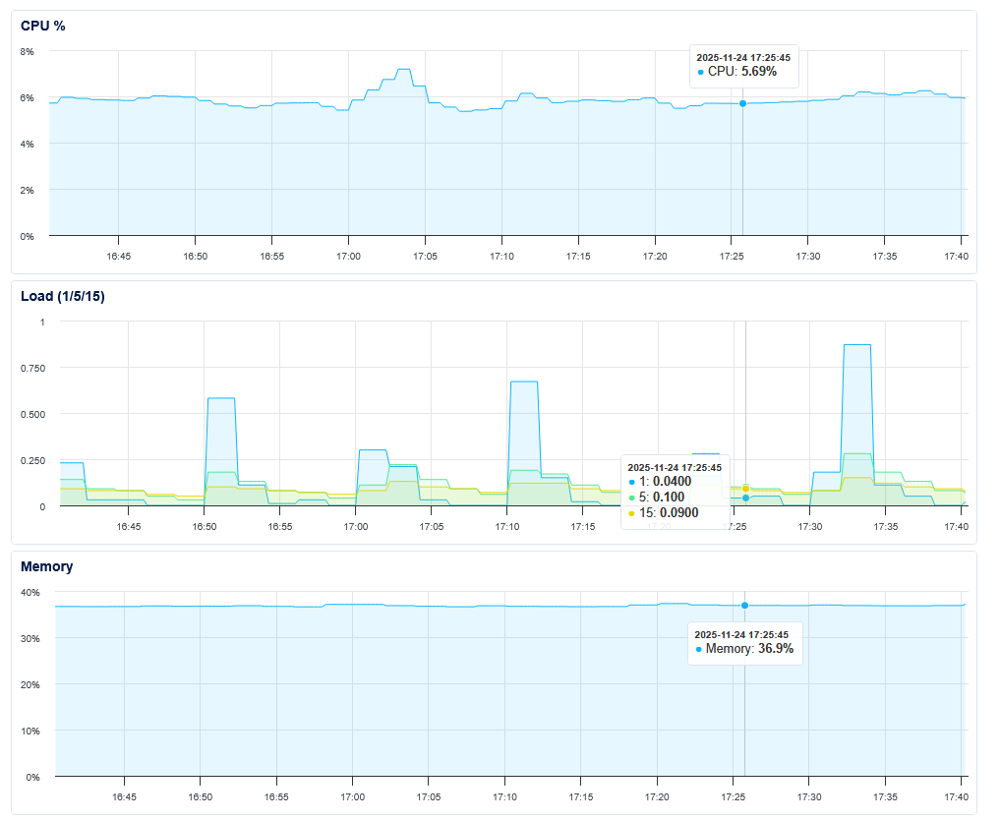
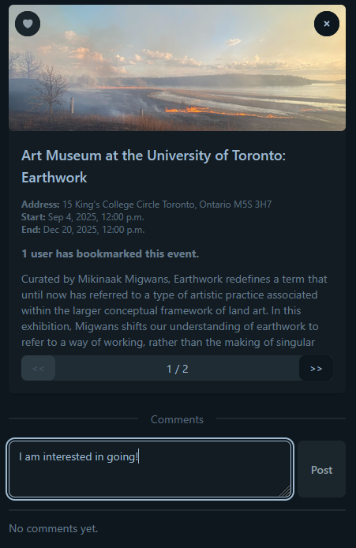
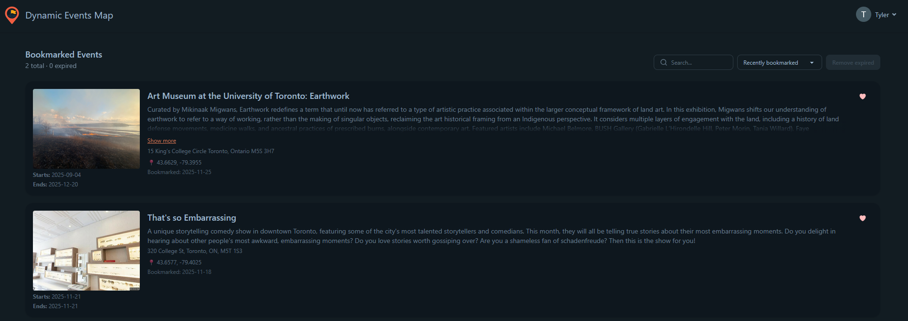
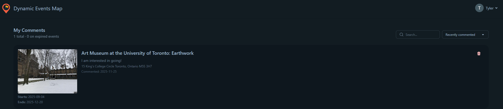
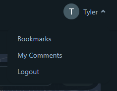

# Dynamic Event Map
A cloud-native web application for discovering local events in real time. Users can explore events on an interactive map, create and manage events, and access public event feeds.

## Development Team
Yuxin Chen - 1005752419, email TBA

Tyler Sun - 1007457645, email TBA

Jiale Shang - 1006580022, email TBA

---

## Description

The **Dynamic Event Map** centralizes user-submitted and public event information, providing a real-time, interactive map to easily discover local activities such as concerts, festivals, food markets, and community gatherings within Toronto. The platform supports community engagement, spontaneous participation, and local exploration in the city.

## Motivation and Objectives

Toronto is a large city with a wide range of events for anyone to get involved in the local community, but it can be difficult to find all possible opportunities in an accessible and contained location as event information is often scattered across different platforms. Even if you are able to find information on interesting occasions, chances are that the event information has been shared too late to be useful as you may have already made plans, or the event has already passed. 

To address this, the **Dynamic Event Map** aggregates user-posted and public event information in one location through an interactive map of Toronto. The application allows for exploration of real-time updates on upcoming events, with comments and bookmarks used to indicate a general level of interest in each event. Users can easily find other events as well as add their own through an intuitive frontend interface using React.js. The project demonstrates **scalable, reliable cloud deployment with stateful orchestration** using Docker Swarm on DigitalOcean, integrating CI/CD pipelines, automated backups, and external services like Google Maps.


## Architecture

- **Frontend**: React.js application served by Nginx
- **Backend**: Node.js REST API with Express
- **Database**: PostgreSQL with initialization scripts
- **Cache**: Redis for performance optimization
- **Load Balancer**: Nginx reverse proxy
- **Orchestration**: Docker Swarm for high availability

# Quick Start Guide

## Environment Files
```bash
DB_USER=user
DB_PASSWORD=password # (dev/local swarm only)
DB_NAME=eventsdb
DB_PORT=5432
REDIS_PORT=6379
BACKEND_PORT=5000
FRONTEND_PORT=3000 #3000 (dev/local swarm), 443 (production)
VITE_GOOGLE_MAPS_KEY=
VITE_API_BASE_URL=http://localhost:5000/api # /api (in swarm)

# Firebase client configuration
VITE_FIREBASE_API_KEY=
VITE_FIREBASE_AUTH_DOMAIN=
VITE_FIREBASE_PROJECT_ID=
VITE_FIREBASE_STORAGE_BUCKET=
VITE_FIREBASE_APP_ID=
VITE_FIREBASE_MESSAGING_SENDER_ID=

# Domain Configuration (Production only)
DOMAIN=<your-domain.com>
EMAIL=<your-LE-domain-email>

# Digital Ocean Space configuration (Production only)
DO_SPACES_BUCKET=eventmap-space
DO_SPACES_ENDPOINT=tor1.digitaloceanspaces.com
DO_SPACES_ACCESS_KEY=
DO_SPACES_SECRET_KEY=
```

## Local Development (Docker Compose)

### 1. Clone and Setup
```bash
git clone https://github.com/chkaty/Dynamic-Event-Map.git
cd Dynamic-Event-Map
```

### 2. Create Environment File
```bash
# Create .env file with your configuration
cp .env.example .env
```

### 3. Enable Firebase authentication
When running as a developer, there should be code added which allows for token verification in Firebase without an account.
To run authentication with your service account key:

Create a file "firebase-service-account.json" in /api:
```bash
cd /Dynamic-Event-Map/api
touch firebase-service-account.json
```
In Firebase, open the Dynamic-Event-Map project. Navigate to: 
Project Overview -> Project Settings (gear icon next to Project Overview) -> Service Accounts -> Generate new private key

Copy the JSON service account key into firebase-service-account.json.

### 4. Run with Docker Compose
```bash
# Start all services
docker-compose -f docker-compose.dev.yml up --build
```

### 5. Access the Application
- **Frontend**: http://localhost:3000
- **Backend API**: http://localhost:5000
- **Database**: http://localhost:5432

---

## Docker Swarm Local

Run the following script to automatically deploy a local Docker Swarm stack for development and testing:

```powershell
.\infra\scripts\deploy_local_swarm.ps1

#or
.\infra\scripts\deploy_local_swarm.ps1 -NoBuild
```

### 1. Initialize Docker Swarm
```powershell
# Initialize swarm mode
docker swarm init

# Add labels to node for database placement
docker node update --label-add postgres=true $(docker info --format '{{.Swarm.NodeID}}')
docker node update --label-add redis=true $(docker info --format '{{.Swarm.NodeID}}')
```
### 2. Local Environment
```powershell
# Load .env variables into current PowerShell session
Get-Content .env | ForEach-Object { 
    if($_ -match '^([^=]+)=(.*)$') { 
        [System.Environment]::SetEnvironmentVariable($matches[1], $matches[2], 'Process') 
    } 
}
```
or
```bash
set -a; source .env; set +a
```
### 3. Create Firebase service account secret
```
docker secret create firebase-service-account.json ./api/firebase-service-account.json
```
### 4. Build Images
```powershell
# Build API image
docker build -t dynamic-event-map-api:latest ./api

# Build Client image
$Env:DOCKER_BUILDKIT=1
docker build -f ./client/Dockerfile `
  -t dynamic-event-map-client:latest `
  --build-arg VITE_GOOGLE_MAPS_KEY=$Env:VITE_GOOGLE_MAPS_KEY `
  --build-arg VITE_FIREBASE_API_KEY=$Env:VITE_FIREBASE_API_KEY `
  --build-arg VITE_FIREBASE_AUTH_DOMAIN=$Env:VITE_FIREBASE_AUTH_DOMAIN `
  --build-arg VITE_FIREBASE_PROJECT_ID=$Env:VITE_FIREBASE_PROJECT_ID `
  --build-arg VITE_FIREBASE_STORAGE_BUCKET=$Env:VITE_FIREBASE_STORAGE_BUCKET `
  --build-arg VITE_FIREBASE_APP_ID=$Env:VITE_FIREBASE_APP_ID `
  --build-arg VITE_FIREBASE_MESSAGING_SENDER_ID=$Env:VITE_FIREBASE_MESSAGING_SENDER_ID `
  client

# Build Event Ingest image
docker build -t dynamic-event-map-events-ingest:latest ./infra/ingest
```

### 5. Deploy Stack with 2 API Replicas
```
docker stack deploy -c docker-compose.swarm-local.yml eventmap
```
### 6. Access the Application
- **Frontend**: http://localhost
- **Backend API**: http://localhost/api
- **Database**: localhost:5432

### 7. Pull with event_ingest service

```
# set replicas to 1 so a task is actually created
docker service update --replicas 1 eventmap_events_ingest
# after task done, scale back to 0
docker service update --replicas 0 eventmap_events_ingest
```

## Deploy Swarm on Digital Ocean

### What you need before starting

- Droplet (Ubuntu LTS). Open ports: 80 (web), optionally 5000 (API), and 22 (SSH).

- DO Volume attached to this droplet (we’ll mount it at /mnt/pgdata).

- Images available in a registry (e.g., GHCR):
    - ghcr.io/<OWNER>/<REPO>-api:latest
    - ghcr.io/<OWNER>/<REPO>-client:latest
    - ...(other services that need internal network)

- Your stack.yml expects:

    - Postgres, Redis bound to /mnt/pgdata/postgres-data, /mnt/pgdata/redis-data
    - Swarm secret named pg_password, redis_password
    - Your db/ init scripts (run only on first DB init)
    - Your Firebase Service Account JSON file

- A Domain owned by yourself and connected to your droplet (A records, service providers setup, ...)

### First Deployment - One-time setup

#### 1. SSH into the droplet and install Docker
```
# As root (or sudo -i to become root)
apt-get update
curl -fsSL https://get.docker.com | sh
usermod -aG docker $USER
```
#### 2. Mount the DigitalOcean Volume at /mnt/pgdata
```
ls -l /dev/disk/by-id/           # find the DO volume (e.g., scsi-0DO_Volume_...)
mkfs.ext4 -F /dev/disk/by-id/<YOUR_VOLUME_ID>
mkdir -p /mnt/pgdata
mount -o defaults /dev/disk/by-id/<YOUR_VOLUME_ID> /mnt/pgdata

# Persist across reboots
echo "/dev/disk/by-id/<YOUR_VOLUME_ID> /mnt/pgdata ext4 defaults,nofail 0 2" >> /etc/fstab
mount -a

mkdir -p /mnt/pgdata/postgres-data
mkdir -p /mnt/pgdata/redis-data

chown -R 999:999 /mnt/pgdata/postgres-data
chmod 700 /mnt/pgdata/postgres-data

chmod 777 /mnt/pgdata/redis-data
```

#### 3. Initialize Docker Swarm
```
docker swarm init --advertise-addr <YOUR_PUBLIC_IPV4>

docker node update --label-add postgres=true $(docker info --format '{{.Swarm.NodeID}}')
docker node update --label-add redis=true $(docker info --format '{{.Swarm.NodeID}}')
```

#### 4. Create the Postgres and redis password secret
```
echo -n 'YOUR_STRONG_DB_PASSWORD' | docker secret create pg_password -
docker secret ls | grep pg_password

echo -n 'YOUR_STRONG_REDIS_PASSWORD' | docker secret create redis_password -
docker secret ls | grep redis_password
```

#### 5. Create a file "firebase-service-account.json" in /api:
```bash
cd /api
touch firebase-service-account.json
```
In Firebase, open the Dynamic-Event-Map project. Navigate to: 
Project Overview -> Project Settings (gear icon next to Project Overview) -> Service Accounts -> Generate new private key

Copy the service account key JSON into firebase-service-account.json.

### Pull & Deploy, Go to Github Action CI/CD section or manually follow:

#### 6. Put your stack files and .env files on the droplet

Create a deploy directory and copy your files (via scp or any secure method):
```
mkdir -p /root/deploy
# From your laptop:
# scp -r stack.yml db/ root@<YOUR_PUBLIC_IPV4>:/root/deploy/
```
Also add/copy a `.env` file to `/root/deploy`.

#### 7. Log into your registry on the droplet and pull images
```
docker login ghcr.io -u <GH_USERNAME>
# (enter your GHCR PAT with packages:read when prompted)

docker pull ghcr.io/<OWNER>/<REPO>-api:latest
docker pull ghcr.io/<OWNER>/<REPO>-client:latest
```

### 8. Deploy the stack
```
cd /root/deploy

# Export env for stack interpolation
set -a
. ./.env
set +a

docker stack deploy -c stack.yml eventmap --with-registry-auth

# Watch it come up
docker stack ls
docker service ls
docker service ps eventmap_db
docker service ps eventmap_api
docker service ps eventmap_client

# Logs (tail)
docker service logs -f eventmap_api
docker service logs -f eventmap_db
```

## After first deployment, One-time Setup (on droplet)

### 9. allow tcp ports:
```bash
sudo ufw allow 80/tcp
sudo ufw allow 443/tcp
```

### 10. Setup Scheduled Timers

Copy the `infra` folder to your droplet `/root/deploy`:

Run `bash /root/deploy/infra/scripts/bootstrap/setup_infra.sh`.


## CI/CD pipelines

On your repo, add the following:

- Repository secrets:

  - `GHCR_USER` (your GH username or org service account)

  - `GHCR_PAT` (token with read:packages and write:packages)

  - `DO_SSH_KEY` (your private SSH key contents)

  - `GOOGLE_MAPS_KEY`

  - `FIREBASE_API_KEY`

  - `FIREBASE_PROJECT_ID`

  - `FIREBASE_APP_ID`

  - `FIREBASE_MESSAGING_SENDER_ID`

  - `DOMAIN`

  - `EMAIL`

  - `DO_SPACES_BUCKET` (DigitalOcean Spaces bucket name for backups)

  - `DO_SPACES_ENDPOINT` (e.g., nyc3.digitaloceanspaces.com)

  - `DO_SPACES_ACCESS_KEY` (Spaces access key)

  - `DO_SPACES_SECRET_KEY` (Spaces secret key)

- Repository variables:

  - `DO_SSH_HOST` (droplet IP)

  - `DO_SSH_USER` (e.g., `root` or your sudo user)

  - `PROD_API_BASE_URL` (e.g., `http://YOUR_IP:5000` or your https domain)

  - and other non-secret variables in `.env.example`

### Database Backup & Restore

The application includes automated database backup to DigitalOcean Spaces with restore capabilities.

1. Create a DigitalOcean Space for backups
2. Add Spaces credentials to `.env` on droplet and GitHub Secrets
3. Build & push backup imges once (by `deploy.yml`)

Manually trigger:

**Backup**:
- Go to Github ACTIONS → Database Backup

**Restore**:
- Go to GitHub Actions → Database Restore
- Select backup file and run workflow

### Toronto Events Ingest

The application includes automated daily pull from Toronto Event&Festival Calendar backup to PostgreSQL database and expired events cleanup.

Manually trigger:

- Go to GitHub ACTIONS → Daily Toronto Ingest

### Cleanup

The application includes automated weekly cleanup of outdated images, logs and system caches using system service & timer on droplet.

It can also be triggered manually with:

- Go to GitHub ACTIONS → Docker Cleanup

## Features

When a user is not logged in, they can access the following:
- Search: locations, addresses, events in Toronto
- View: events including event details and number of people who have bookmarked an event
- Filter: view events by distance of current position, category, and start time
  - Distance: adjust radius of events from current position in km. When set at 0 km, all events satisfying the other criteria is shown.
  - Category: can view events from all categories or select from individual categories below
    - Arts & Culture
    - Entertainment & Leisure
    - Education & Workshops
    - Sports & Fitness
    - Food & Drink
    - Business & Networking
    - Community & Social
    - Family & Kids
    - Technology & Innovation
    - Other
  - Time: can filter from events ending within 24 hours, 7 days, or 30 days of the current time, or starting at any time

Data ingestion is performed automatically and weekly from the official Toronto Events and Festivals Calendar API, which includes a cleanup of expired events and clearing of the Redis cache. This ensures the map remains up-to-date on included events.

As a security enhancement, users can authenticate themselves by logging in with their Google account, adding their profile to the database with PostgreSQL. Once they have logged in, users gain access to the following features:
- Add, edit and delete your own events complete with start time, end time, address, category and description
- Add and delete comments on any event
- Add and remove personal bookmarks from any individual events
- View all of your comments in the My Comments tab
- View and sort bookmarks in the Bookmarks tab
Event details, including comments and bookmarks, are stored with PostgreSQL for relational persistence. These additions, edits or deletions can be viewed in real time on the application front end with the implementation of web sockets, another advanced feature.

Key metrics on the application, including CPU, memory and disk usage, can be tracked through DigitalOcean monitoring. Email alerts have been set up to send emails to all developers if any of the following are detected:
- CPU utilization over 80% for 5 minutes
- Memory utilization over 85% for 10 minutes
- Disk utilization over 80% for 5 minutes



Additional advanced features for workflow:
- CI/CD pipeline: use GitHub Actions for easier deployment upon every push to main
- Backup and recovery: use GitHub Actions which triggers an automated weekly backup of data to DigitalOcean spaces. Recovery is performed manually from DigitalOcean spaces if needed.

## User Guide

The main page of the **Dynamic Event Map** application features the layout of Toronto from the Google Maps API, which can be navigated by dragging along the map and zooming in/out by scrolling. Red markers and blue markers with numbers indicate an event or events in the area. Zooming in allows more events to be easily spotted and more accessible with red markers, while zooming out will bunch events in the same general location together as blue markers. All events represented by a blue marker can be accessed by clicking on one and scrolling through using the arrows in the side bar.

Any user can navigate the map and search for events using the search bar provided. When a user clicks on an event, they can view its address, start time and end time, as well as a short description if provided. Interested users who are authenticated can bookmark an event by toggling the heart icon at the top left of an event page and leave comments on any event. The total number of users who have bookmarked an event is given to indicate overall interest and possible attendance. Authenticated users can also post their own events by selecting a designated location and filling out the necessary fields (address, time, type of event and description). Users can edit and delete their own events after posting.



Users can customize their UI to show varying amounts of information on local events. The filter toggle displays a menu allowing the user to filter out events shown based on time window, event category, and max distance from the user's current position in kilometers. The search toggle activates the search bar allowing users to find and add events as described above. The stats toggle displays the total number of events which can be found on the map. This total adjusts with the filter applied by the user, providing the user with an idea of how many events can be found in a given area or within a specific timeframe. All of these menus can be toggled allowing the user to balance wider visibility of the map with important functionality and information while maintaining an intuitive user interface.


If a user is not logged in, they are able to search for locations and events, view event details and comments, and apply all UI customization described earlier. A user can log in with their Google account using the Sign In with Google button on the top right. If prompted, the user should accept the basic permissions required from Google which grants users access to add, edit and delete their own events, add and delete their own comments, and bookmark any events of interest.

Logging in also replaces the Sign In button with a drop down menu at the top right, where users can view and manage all their comments from the "My Comments" tab and sort them by chronigical order of posting or by associated event name in alphabetical order. Any logged in user can easily view all their bookmarked events as well by clicking on the dropdown menu and selecting the Bookmark page. Users can order their bookmarked events by alphabetical order or chronological order by start date, with both available in an ascending or descending manner.




Users can navigate back to the home page by clicking on the logo in the top left. If a user has finished all necessary tasks needed with an account, they can log out through the dropdown menu in the top right at any time.




## Data Attribution & Licensing

### Toronto Open Data

This application uses public event data from the **City of Toronto's Open Data Portal** under the [Open Government Licence – Toronto](https://www.toronto.ca/city-government/data-research-maps/open-data/open-data-licence/).

**Data Source**: [Toronto Festivals & Events Calendar](https://open.toronto.ca/dataset/festivals-events/)
### Copyright Compliance

- **Event Data**: Licensed under Open Data, no copyright restrictions
- **Event Images**: Provided via the Open Data API, included under the same license
- **User-Generated Content**: All user-submitted events and content remain the property of their respective creators

For questions about data usage, contact Toronto Open Data at opendata@toronto.ca