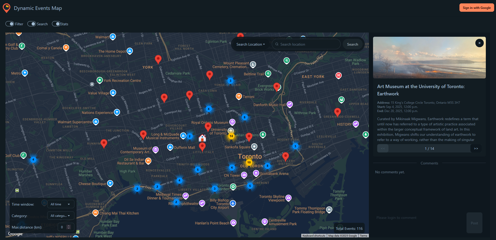
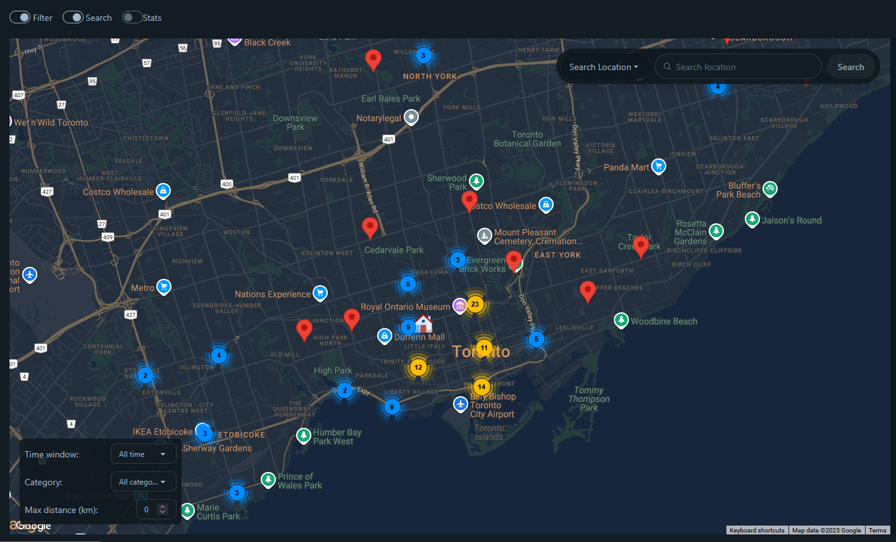
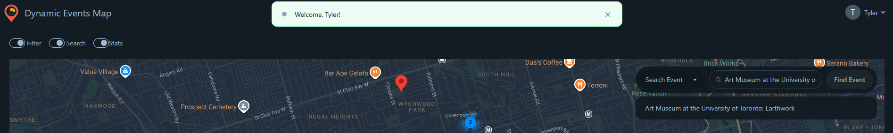
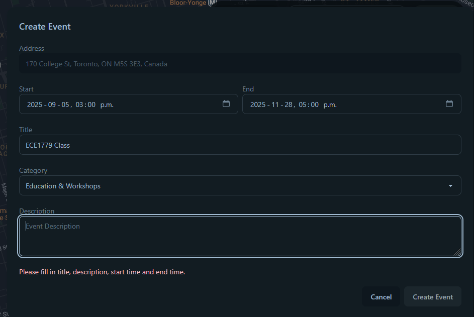

# Dynamic Event Map
The **Dynamic Event Map** centralizes user-submitted and public event information, providing a real-time, interactive map to easily discover local activities such as concerts, festivals, food markets, and community gatherings within Toronto. The platform supports community engagement, spontaneous participation, and local exploration in the city.

## Development Team Information
Yuxin Chen - 1005752419, katy.chen@mail.utoronto.ca

Tyler Sun - 1007457645, tyl.sun@mail.utoronto.ca

Jiale Shang - 1006580022, jiale.shang@mail.utoronto.ca

## Motivation
Toronto hosts a wide variety of community events, but information is scattered across platforms, shared inconsistently, and often discovered too late to be useful. Users must search multiple sites and social feeds, making it hard to find opportunities that match their interests in time.
Our team wanted to build a system that solves this accessibility problem by offering a **single, real-time, city-wide event map** that is easy to use, always updated, and reliable at scale.

## Objective
The goal of the **Dynamic Event Map** is to aggregate both user-submitted and publicly available event information into a single, interactive map of Toronto. The application enables real-time browsing of upcoming events, with comments and bookmarks reflecting community interest. Users can easily explore, save, and contribute events through an intuitive React.js interface.

To ensure the platform can reliably support city-wide usage, the system is deployed as a cloud-based application. Cloud infrastructure provides scalability, high availability, and real-time responsiveness. Docker Swarm orchestration on DigitalOcean further enhances fault tolerance, simplifies maintenance, and supports seamless integration with external services like Google Maps.

## Architecture
- **Frontend**: React.js application served by Nginx
- **Backend**: Node.js REST API with Express
- **Database**: PostgreSQL with initialization scripts
- **Cache**: Redis for performance optimization
- **Load Balancer**: Nginx reverse proxy
- **Orchestration**: Docker Swarm for high availability
- **Deployment Provider**: DigitalOcean Ubuntu droplet (IaaS)
- **Web Socket**: socket.io
- **External API**:
  - Google Maps API
  - Firebase (Auth)
  - Toronto Open Data API
- **Infrastructure**: Traefik (routing/TLS), DigitalOcean Volumes & Spaces (state + backups), Let's Encrypt (certificates), Github Actions (Serverless Functions, CI/CD)

All services (API, Client, Events Ingest, Backup/Restore) are containerized with dedicated Dockerfiles. Multi-service development uses `docker-compose.dev.yml`, while production/stateful clustering uses Swarm via `stack.yml`.

## Features

When a user is not logged in, they can access the following:
- Search: locations, addresses, and events in Toronto which have been stored in the PostgreSQL database
- View: Toronto events, including event details and number of people who have bookmarked an event
- Filter: view events by distance of current position, category, and start time

Data ingestion is performed automatically and weekly from the official Toronto Events and Festivals Calendar API, which includes a cleanup of expired events and clearing of the Redis cache. This ensures the map remains up-to-date on included events.

As a security enhancement, users can authenticate themselves by logging in with their Google account, adding their profile to the database with PostgreSQL. Once they have logged in, users gain access to the following features:
- Add, edit and delete your own events complete with start time, end time, address, category and description
- Add and delete comments on any event
- Add and remove personal bookmarks from any individual events
- View, search and sort your comments in the My Comments tab
- View, search and sort your bookmarks in the Bookmarks tab
- Get message of how many of your bookmarked events are starting/ending today

These additions, edits or deletions can be viewed in **real time** on the application front end with the integration of web sockets, an advanced feature which enables live updates for current users.

A timeout feature has been added as part of secure session management, where the application detects if a logged in user has been idle for around one hour. Any inactive user will be logged out after one hour to protect user security and ensure API requests which require authentication are not performed with an expired authentication token.

Another security addition includes HTTPS over HTTP, which is provided by Traefik v3 using Let’s Encrypt ACME. The protocol's implementation in the app can be broken down as follows:
- Entrypoints: `web` (80) with automatic redirect to `websecure` (443).
- ACME HTTP challenge on `web`; resolver `le` stores certs at `/letsencrypt/acme.json`.
- Routers:
  - `api` on `https://www.${DOMAIN}/api` with TLS (`traefik.http.routers.api.tls.certresolver=le`).
  - `client` on `https://www.${DOMAIN}` with TLS and a redirect from bare domain to `www` via `redirect-to-www` middleware.
  - Traefik dashboard at `https://traefik.${DOMAIN}`.
- Labels configure TLS, routers, middlewares, sticky load balancing for API, and service ports.
- Traefik runs with Swarm provider and manages certificates automatically.

Event details, including comments and bookmarks, are stored alongside user profiles with PostgreSQL for relational persistence. Comments and bookmarks include references to the original users whose profiles are also stored in a PostgreSQL table. This data is stored using DigitalOcean volumes for state management, ensuring important information is not lost on container restarts or redeployments. Data is further preserved with backup and recovery implementation through DigitalOcean Spaces, where an automated weekly backup of data to DigitalOcean spaces is triggered with GitHub Actions. Recovery is performed manually from DigitalOcean spaces if needed. Logs can be used to verify the backup and recovery processes ran as expected.


The application's frontend and backend features are containerized with Docker, allowing for high portability and fast deployment across environments. Docker Compose is used to manage all necessary containers including the database, Redis cache, API and client services needed for the complete application, and is also used for local development and testing. For production, the Dynamic Event Map has been deployed as a web app and is accessible online using a DigitalOcean droplet for an IaaS (Infrastructure as a Service) focused model. Orchestration and clustering is performed with Docker Swarm, with load balancing so the application can manage requests from multiple sources. The stack is prepared on Docker Swarm with 2 replicas before being deployed on the droplet.

For easier creation and deployment of app software, a fully automated CI/CD pipeline has been added with GitHub Actions. Upon each new push to main, the workflow builds Docker images for app services and pushes them to GitHub Container Registry. Deployment files and variables are uploaded to our droplet, where the workflow sets up secrets and volumes, pulls the latest images, and deploys the stack on connection.

Key metrics on the application, including CPU, memory and disk usage, can be tracked through DigitalOcean monitoring after deployment. Email alerts have been set up to send emails to all developers if any of the following are detected:
- CPU utilization over 80% for 5 minutes
- Memory utilization over 85% for 10 minutes
- Disk utilization over 80% for 5 minutes

An email will also be sent once these issues are resolved, confirming application metrics have returned to an acceptable level.

### Summary of Features

The features of the application integrate and satisfy all core requirements for a cloud application, including containerization and local development with Docker and Docker Compose, state management with PostgreSQL databases of event and user information, deployment with DigitalOcean, orchestration and clustering with load balancing with Docker Swarm, and monitoring with DigitalOcean metrics and alerts. The frontend is built with React.js and handles by Nginx which showcases and applies these features through a web interface. Advanced features which have been fully integrated include real-time functionality with WebSockets, security enhancements with open authentication and HTTPS, and a CI/CD pipeline for automated deployments along with weekly backup and recovery through DigitalOcean spaces, both using GitHub Actions.

## User Guide

The main page of the **Dynamic Event Map** application features the layout of Toronto from the Google Maps API, which can be navigated by dragging along the map and zooming in/out by scrolling. Red markers indicate one event in the area, while blue and yellow markers with numbers indicate multiple or events in the area. Zooming in allows more events to be easily spotted and more accessible with red markers, while zooming out will bunch events in the same general location together as blue or yellow markers. All events represented through one blue or yellow marker can be accessed by clicking on one and scrolling through using the arrows in the side bar.



Any user can navigate the map and search for addresses or events using the search bar provided with the "Search Location" or "Search Event" options in the search bar menu. When a user clicks on an event in the interactive map, they can view its address, start time and end time, as well as a short description if provided. Interested users who are authenticated can bookmark an event by toggling the heart icon at the top left of an event page and leave comments on any event. The total number of users who have bookmarked an event is given to indicate overall interest and possible attendance. Authenticated users can also post their own events by selecting a designated location and filling out the necessary fields (address, time, type of event and description). Users can edit their event fields and delete their own events after posting.


Users can customize their UI to show varying amounts of information on local events. These toggles are:
- Filter
- Search
- Stats  

The filter toggle displays a menu allowing the user to filter out events shown based on time window, event category, and max distance from the user's current position in kilometers. The search toggle activates the search bar allowing users to find and add events as described above. The stats toggle displays the total number of events which can be found on the map, seen in the bottom right. This total adjusts with the filter applied by the user, providing the user with an idea of how many events can be found in a given area or within a specific timeframe. All of these menus can be toggled allowing the user to balance wider visibility of the map with important functionality and information while maintaining an intuitive user interface.



Specific filters for events:
  - Distance: adjust radius of events from current position in km. When set at 0 km, all events satisfying the other filter criteria is shown.
  - Category: can view events from all categories, or select from one of the individual categories below
    - Arts & Culture
    - Entertainment & Leisure
    - Education & Workshops
    - Sports & Fitness
    - Food & Drink
    - Business & Networking
    - Community & Social
    - Family & Kids
    - Technology & Innovation
    - Other
  - Time: ending at any time, or ending in 24 hours, 7 days, or 30 days from the current time.


### Authenticated Users

If a user is not logged in, they are able to search for locations and events, view event details and comments, and apply all UI customization described earlier. A user can log in with their Google account using the Sign In with Google button on the top right. If prompted, the user should accept the basic permissions required from Google which grants users access to add, edit and delete their own events, add and delete their own comments, and bookmark any events of interest. A notification will pop up indicating a successful log in with the user's Google account name.



Logging in also replaces the Sign In button with a drop down menu at the top right, where users can view and manage all their comments from the "My Comments" tab and sort them by chronigical order of posting or by associated event name in alphabetical order. Any logged in user can easily view all their bookmarked events as well by clicking on the dropdown menu and selecting the Bookmark page. Users can order their bookmarked events by alphabetical order or chronological order by start date, with both available in an ascending or descending manner.


To add an event, select "Add Event" from the search bar menu and search for the target location by address or name of the location if applicable. If a valid address is found, a form will pop up with the address which requires the following fields:
- Start and end time: date and time in HH:MM format, 12 hour format (specify am/pm)
- Title (of the event)
- Category: possible categories seen above with filters
- Description (of the event)  

Once these are filled out, select "Create Event" to view your event at the specified address. All fields are mandatory in the form - an error message will appear if any of the fields are left empty. If the event is no longer desired on the map, use the Cancel button before creating or delete the event after creating it by clicking on it in the map and deleting it from the sidebar. The sidebar also provides a button to edit the event if it is your event.



Users can navigate back to the home page by clicking on the logo in the top left. If a user has finished all necessary tasks needed with an account, they can log out through the dropdown menu in the top right at any time. The application will also log out users automatically after 59 minutes if no activity is detected.


# Development Guide

Clone this repo by
```bash
git clone https://github.com/chkaty/Dynamic-Event-Map.git
cd Dynamic-Event-Map
```

## Prerequisite

Register accounts for:

- Digital Ocean
- Firebase Authentication
- Google Map API Key

## Environment Files

Put `.env` at root of the project with your configration as:

```bash
DB_USER=user
DB_PASSWORD=password # (dev/local swarm only)
DB_NAME=eventsdb
DB_PORT=5432
REDIS_PORT=6379
BACKEND_PORT=5000
FRONTEND_PORT=3000 #3000 (dev/local swarm), 443 (production)
VITE_GOOGLE_MAPS_KEY=
VITE_API_BASE_URL=http://localhost:5000/api # /api (in swarm)

# Firebase client configuration
VITE_FIREBASE_API_KEY=
VITE_FIREBASE_AUTH_DOMAIN=
VITE_FIREBASE_PROJECT_ID=
VITE_FIREBASE_STORAGE_BUCKET=
VITE_FIREBASE_APP_ID=
VITE_FIREBASE_MESSAGING_SENDER_ID=

# Domain Configuration (Production only)
DOMAIN=<your-domain.com>
EMAIL=<your-LE-domain-email>

# Digital Ocean Space configuration (Production only)
DO_SPACES_BUCKET=eventmap-space
DO_SPACES_ENDPOINT=tor1.digitaloceanspaces.com
DO_SPACES_ACCESS_KEY=
DO_SPACES_SECRET_KEY=
```

In `/api`, Create a file "firebase-service-account.json" in /api:
```bash
cd /Dynamic-Event-Map/api
touch firebase-service-account.json
```
In Firebase, open the Dynamic-Event-Map project. Navigate to: 
Project Overview -> Project Settings (gear icon next to Project Overview) -> Service Accounts -> Generate new private key

From here, you can choose to continue with dev server, local docker swarm, or production deployment.

## Local Development (Docker Compose)

To run the app with dev react server:
```bash
# Start all services
docker-compose -f docker-compose.dev.yml up --build
```

### Access the Application
- **Frontend**: http://localhost:3000
- **Backend API**: http://localhost:5000
- **Database**: http://localhost:5432

## Docker Swarm Local

With all the env files setup, run the following script to automatically deploy a local Docker Swarm stack for development and testing:

```powershell
.\infra\scripts\deploy_local_swarm.ps1

#or
.\infra\scripts\deploy_local_swarm.ps1 -NoBuild
```

Or manually follow:

### 1. Initialize Docker Swarm
```powershell
# Initialize swarm mode
docker swarm init

# Add labels to node for database placement
docker node update --label-add postgres=true $(docker info --format '{{.Swarm.NodeID}}')
docker node update --label-add redis=true $(docker info --format '{{.Swarm.NodeID}}')
```
### 2. Local Environment
```powershell
# Load .env variables into current PowerShell session
Get-Content .env | ForEach-Object { 
    if($_ -match '^([^=]+)=(.*)$') { 
        [System.Environment]::SetEnvironmentVariable($matches[1], $matches[2], 'Process') 
    } 
}
```
or
```bash
set -a; source .env; set +a
```
### 3. Create Firebase service account secret
```
docker secret create firebase-service-account.json ./api/firebase-service-account.json
```
### 4. Build Images
```powershell
# Build API image
docker build -t dynamic-event-map-api:latest ./api

# Build Client image
$Env:DOCKER_BUILDKIT=1
docker build -f ./client/Dockerfile `
  -t dynamic-event-map-client:latest `
  --build-arg VITE_GOOGLE_MAPS_KEY=$Env:VITE_GOOGLE_MAPS_KEY `
  --build-arg VITE_FIREBASE_API_KEY=$Env:VITE_FIREBASE_API_KEY `
  --build-arg VITE_FIREBASE_AUTH_DOMAIN=$Env:VITE_FIREBASE_AUTH_DOMAIN `
  --build-arg VITE_FIREBASE_PROJECT_ID=$Env:VITE_FIREBASE_PROJECT_ID `
  --build-arg VITE_FIREBASE_STORAGE_BUCKET=$Env:VITE_FIREBASE_STORAGE_BUCKET `
  --build-arg VITE_FIREBASE_APP_ID=$Env:VITE_FIREBASE_APP_ID `
  --build-arg VITE_FIREBASE_MESSAGING_SENDER_ID=$Env:VITE_FIREBASE_MESSAGING_SENDER_ID `
  client

# Build Event Ingest image
docker build -t dynamic-event-map-events-ingest:latest ./infra/ingest
```

### 5. Deploy Stack with 2 API Replicas
```
docker stack deploy -c docker-compose.swarm-local.yml eventmap
```
### 6. Access the Application
- **Frontend**: http://localhost
- **Backend API**: http://localhost/api
- **Database**: localhost:5432

### 7. Pull with event_ingest service (Optional)

```
# set replicas to 1 so a task is actually created
docker service update --replicas 1 eventmap_events_ingest
# after task done, scale back to 0
docker service update --replicas 0 eventmap_events_ingest
```

## Deploy Swarm on Digital Ocean

### What you need before starting

- Droplet (Ubuntu LTS). Open ports: 443.

- DO Volume attached to this droplet (we’ll mount it at /mnt/pgdata).

- Images available in a registry (e.g., GHCR):
    - ghcr.io/<OWNER>/<REPO>-api:latest
    - ghcr.io/<OWNER>/<REPO>-client:latest
    - ...(other services that need internal network)

- Your stack.yml expects:

    - Postgres, Redis bound to /mnt/pgdata/postgres-data, /mnt/pgdata/redis-data
    - Swarm secret named pg_password, redis_password
    - Your db/ init scripts (run only on first DB init)
    - Your Firebase Service Account JSON file

- A Domain owned by yourself and connected to your droplet (A records, service providers setup, ...)

### First Deployment - One-time setup

#### 1. SSH into the droplet and install Docker
```
# As root (or sudo -i to become root)
apt-get update
curl -fsSL https://get.docker.com | sh
usermod -aG docker $USER
```
#### 2. Mount the DigitalOcean Volume at /mnt/pgdata
```
ls -l /dev/disk/by-id/           # find the DO volume (e.g., scsi-0DO_Volume_...)
mkfs.ext4 -F /dev/disk/by-id/<YOUR_VOLUME_ID>
mkdir -p /mnt/pgdata
mount -o defaults /dev/disk/by-id/<YOUR_VOLUME_ID> /mnt/pgdata

# Persist across reboots
echo "/dev/disk/by-id/<YOUR_VOLUME_ID> /mnt/pgdata ext4 defaults,nofail 0 2" >> /etc/fstab
mount -a

mkdir -p /mnt/pgdata/postgres-data
mkdir -p /mnt/pgdata/redis-data

chown -R 999:999 /mnt/pgdata/postgres-data
chmod 700 /mnt/pgdata/postgres-data

chmod 777 /mnt/pgdata/redis-data
```

#### 3. Initialize Docker Swarm
```
docker swarm init --advertise-addr <YOUR_PUBLIC_IPV4>

docker node update --label-add postgres=true $(docker info --format '{{.Swarm.NodeID}}')
docker node update --label-add redis=true $(docker info --format '{{.Swarm.NodeID}}')
```

#### 4. Create the Postgres and redis password secret
```
echo -n 'YOUR_STRONG_DB_PASSWORD' | docker secret create pg_password -
docker secret ls | grep pg_password

echo -n 'YOUR_STRONG_REDIS_PASSWORD' | docker secret create redis_password -
docker secret ls | grep redis_password
```

#### 5. Create a file "firebase-service-account.json" in /api:
```bash
cd /api
touch firebase-service-account.json
```
In Firebase, open the Dynamic-Event-Map project. Navigate to: 
Project Overview -> Project Settings (gear icon next to Project Overview) -> Service Accounts -> Generate new private key

Copy the service account key JSON into firebase-service-account.json.

### Pull & Deploy, Go to Github Action CI/CD section or manually follow:

#### 6. Put your stack files and .env files on the droplet

Create a deploy directory and copy your files (via scp or any secure method):
```
mkdir -p /root/deploy
# From your laptop:
# scp -r stack.yml db/ root@<YOUR_PUBLIC_IPV4>:/root/deploy/
```
Also add/copy a `.env` file to `/root/deploy`.

#### 7. Log into your registry on the droplet and pull images
```
docker login ghcr.io -u <GH_USERNAME>
# (enter your GHCR PAT with packages:read when prompted)

docker pull ghcr.io/<OWNER>/<REPO>-api:latest
docker pull ghcr.io/<OWNER>/<REPO>-client:latest
```

### 8. Deploy the stack
```
cd /root/deploy

# Export env for stack interpolation
set -a
. ./.env
set +a

docker stack deploy -c stack.yml eventmap --with-registry-auth

# Watch it come up
docker stack ls
docker service ls
docker service ps eventmap_db
docker service ps eventmap_api
docker service ps eventmap_client

# Logs (tail)
docker service logs -f eventmap_api
docker service logs -f eventmap_db
```

## After first deployment, One-time Setup (on droplet)

### 9. allow tcp ports:
```bash
sudo ufw allow 80/tcp
sudo ufw allow 443/tcp
```

### 10. Setup Scheduled Timers

Copy the `infra` folder to your droplet `/root/deploy`:

Run `bash /root/deploy/infra/scripts/bootstrap/setup_infra.sh`.


## CI/CD pipelines

On your repo, add the following:

- Repository secrets:

  - `GHCR_USER` (your GH username or org service account)

  - `GHCR_PAT` (token with read:packages and write:packages)

  - `DO_SSH_KEY` (your private SSH key contents)

  - `GOOGLE_MAPS_KEY`

  - `FIREBASE_API_KEY`

  - `FIREBASE_PROJECT_ID`

  - `FIREBASE_APP_ID`

  - `FIREBASE_MESSAGING_SENDER_ID`

  - `DOMAIN`

  - `EMAIL`

  - `DO_SPACES_BUCKET` (DigitalOcean Spaces bucket name for backups)

  - `DO_SPACES_ENDPOINT` (e.g., nyc3.digitaloceanspaces.com)

  - `DO_SPACES_ACCESS_KEY` (Spaces access key)

  - `DO_SPACES_SECRET_KEY` (Spaces secret key)

- Repository variables:

  - `DO_SSH_HOST` (droplet IP)

  - `DO_SSH_USER` (e.g., `root` or your sudo user)

  - `PROD_API_BASE_URL` (e.g., `http://YOUR_IP:5000` or your https domain)

  - and other non-secret variables in `.env.example`

### Database Backup & Restore

The application includes automated database backup to DigitalOcean Spaces with restore capabilities.

1. Create a DigitalOcean Space for backups
2. Add Spaces credentials to `.env` on droplet and GitHub Secrets
3. Build & push backup imges once (by `deploy.yml`)

Manually trigger:

**Backup**:
- Go to Github ACTIONS → Database Backup

**Restore**:
- Go to GitHub Actions → Database Restore
- Select backup file and run workflow

### Toronto Events Ingest

The application includes automated daily pull from Toronto Event&Festival Calendar backup to PostgreSQL database and expired events cleanup.

Manually trigger:

- Go to GitHub ACTIONS → Daily Toronto Ingest

### Cleanup

The application includes automated weekly cleanup of outdated images, logs and system caches using system service & timer on droplet.

It can also be triggered manually with:

- Go to GitHub ACTIONS → Docker Cleanup

## Deployment Information

The app is deployed at: https://www.dynamic-event-map.cloud/

## Individual Contributions

### Frontend
| Feature | Team Member(s) | Description / Responsibilities |
|---------|----------------|-------------------------------|
| **Bookmark Page** | Jiale | Developed the UI for viewing, adding, and removing bookmarks. Implemented sorting and searching of bookmarked events. |
| **Bookmark Tracking** | Tyler | Developed a live tracker on the number of users who have bookmarked each event, updated in real time with WebSockets. |
| **Comments** | Yuxin | Built the comment feature allowing users to add, delete, and view comments on events, with real-time updates via WebSockets. |
| **Map Interface** | Yuxin | Developed the interactive map using Google Maps API, including map rendering, zoom behavior, navigation, event detail views, and dynamic search and filters for category, distance, and time. |
| **My Comments Page** | Jiale | Developed the interface for managing all user comments, including adding, deleting, sorting, and searching comments. |
| **New Event** | Yuxin | Implemented the interface for authenticated users to add, edit, and delete their own events, including form validation, category selection, and event data submission. |
| **Notifications & Stats** | Jiale | Implemented notifications to alert users when their bookmarked events are starting or ending today, and created usage statistics displays to provide insights into user engagement and event activity. |
| **User Sign In** | Tyler | Implemented an option for guest users to sign in with pop-up and display a summary of the user's Google account when logged in, including their Google username and profile picture. |

### Backend
| Feature | Team Member(s) | Description / Responsibilities |
|---------|----------------|-------------------------------|
| **REST API & Data Management** | All Members | Created REST endpoints for events, comments, bookmarks, and user management. Integrated Toronto Open Data API for automated event ingestion, handled weekly data updates, cleaned expired events, and managed Redis caching for performance. |
| **WebSocket Integration** | Yuxin | Implemented WebSocket communication between frontend and backend to enable real-time updates for events, comments, and bookmarks. |

### Authentication & Security
| Feature | Team Member(s) | Description / Responsibilities |
|---------|----------------|-------------------------------|
| **Firebase Google Login & Secure Session Handling** | Tyler | Implemented user authentication with Firebase, including Google login and secure session management for authenticated users. |
| **User Access Control** | Yuxin | Managed permissions for authenticated features, ensuring that only authorized users can add, edit, or delete events, comments, and bookmarks. |
| **Routing Rules & HTTPS with Traefik** | Jiale | Configured Traefik for secure HTTPS communication, including routing rules, certificate management with Let’s Encrypt, and redirect setup for production deployment. |

### Deployment & Automation
| Feature | Team Member(s) | Description / Responsibilities |
|---------|----------------|-------------------------------|
| **Containerization & Deployment** | Jiale | Dockerized all services, created Docker Compose and Docker Swarm configurations, managed persistent volumes, and deployed the stack to DigitalOcean with stateful orchestration. |
| **CI/CD & Automation** | Jiale | Built automated GitHub Actions workflows for building, pushing, and deploying Docker images. Configured backup and restore pipelines to DigitalOcean Spaces and automated ingestion and cleanup processes. |

### Monitoring & Quality Assurance
| Feature | Team Member(s) | Description / Responsibilities |
|---------|----------------|-------------------------------|
| **Monitoring & Metrics** | All Members | Configured DigitalOcean monitoring, set up email alerts for CPU, memory, and disk usage thresholds, and created usage statistics dashboards for tracking application performance. |
| **Testing & Quality Assurance** | All Members | Conducted unit, integration, and end-to-end testing across frontend, backend, WebSocket integration, and deployment pipelines to ensure system reliability and correctness. |


## Lessons Learned
1. Defining clear system boundaries and technical requirements at the outset is essential for aligning team efforts and preventing costly redesigns later in the development cycle.
2. Regular check-ins, clear task ownership, and consistent documentation significantly enhanced collaboration and minimized ambiguity during development.
3. Adopting a cycle of incremental testing, feedback, and adjustment allowed the team to detect issues early, improve stability, and strengthen the robustness of the final application.
4. Successful cloud deployment required a consistent workflow between local development and production. Ensuring parity between Compose and Swarm files made the transition to DigitalOcean significantly smoother and more predictable.

## Concluding Remarks
The Dynamic Event Map provides an effective and user friendly solution to the fragmented nature of event information in a large metropolitan area such as Toronto. By bringing both public and user generated events into a single interactive platform, the application makes it easier for residents to discover activities of interest and enables event organizers to reach a wider audience. This unified system has the potential to strengthen community engagement and improve social connection across the city.

From a technical perspective, the project successfully implements a fully stateful cloud based architecture that meets all course requirements. Core technologies such as Docker for containerization, Docker Swarm for orchestration, PostgreSQL for persistent data storage, and DigitalOcean for deployment and monitoring form the foundation of a reliable and scalable solution. Advanced features, including GitHub Actions for continuous integration and deployment, DigitalOcean Spaces for backup and recovery, and Firebase for secure authentication, further enhance the robustness and practicality of the application.

Together, these components demonstrate the strengths of modern cloud computing and present a complete, functional, and well engineered web application that achieves its objectives and delivers meaningful value to its intended community.

## Data Attribution & Licensing

### Toronto Open Data

This application uses public event data from the **City of Toronto's Open Data Portal** under the [Open Government Licence – Toronto](https://www.toronto.ca/city-government/data-research-maps/open-data/open-data-licence/).

**Data Source**: [Toronto Festivals & Events Calendar](https://open.toronto.ca/dataset/festivals-events/)
### Copyright Compliance

- **Event Data**: Licensed under Open Data, no copyright restrictions
- **Event Images**: Provided via the Open Data API, included under the same license
- **User-Generated Content**: All user-submitted events and content remain the property of their respective creators

For questions about data usage, contact Toronto Open Data at opendata@toronto.ca
